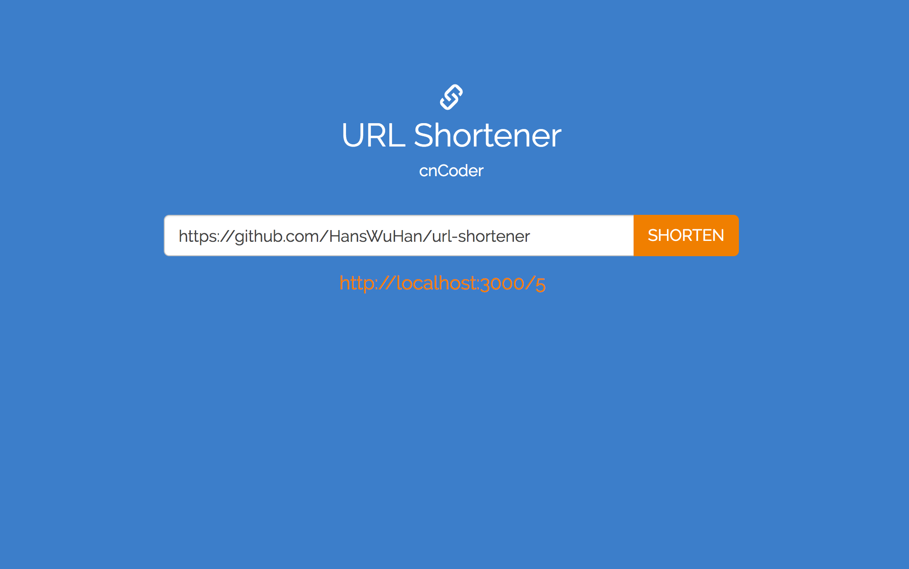

# url-shortener

- Implemented a website with MongoDB/Mongoose, Node.js for URL shortening
- Designed the single-page website with HTML/CSS and response of shorten-URL with AJAX.
- Implemented MVC backend with express.js on MongoDB
